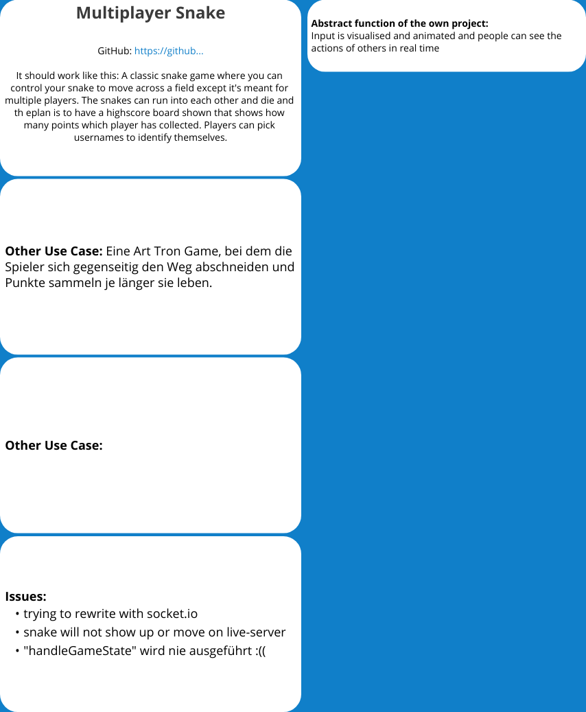

# Two-Player Snake

### Leslie Joyce Hartmann, SS23

---

[Play here](https://p4creativecoding.github.io/multiplayerSnake_Hartmann/frontend/)

---

## What's this?

MULTIPLAYER SNAKE!
You can start a room for two players and it will give you a code to share with a friend. They can then enter that and join your existing game with their own snake.

### What can you do?

- The snakes are controlled by the arrow keys.
- Avoid the walls and don't run into yourselves.
- Catch the food to grow your snake.

## Functionality and Usecases

#### Sources
- [Multiplayer Snake by HungryTurtleCode](https://github.com/HungryTurtleCode/multiplayerSnake)
